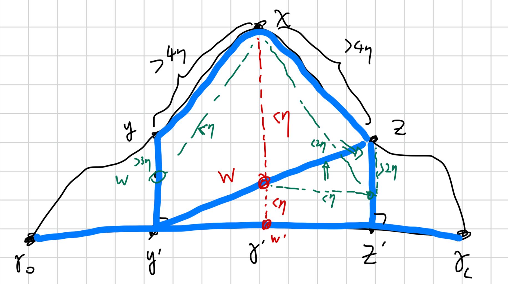

# Hyperbolic geometry 

This section recounts the basic concepts of geometric group theory. 
We also discuss the Dehn algorithm for solving the word problem in 
hyperbolic groups; this problem exemplifies the implications of hyperbolicity 
and helps us compute the Cayley graphs of known hyperbolic groups. 

References: 

1. _Geometric Group Theory: an Introduction_ [@loh2017geometric]. 
    - Chapter 5: Quasi-isometries. 
    - Chapter 7: Geodesics and hyperbolicity. 
    - Chapter 8: Gromov boundaries. 
2. [Hyperbolicity and the Word Problem](https://math.uchicago.edu/~may/REU2013/REUPapers/Hyun.pdf). 

Main takeaways:

1. Quasi-properties are only sensitive to behaviors on a large (but uniform) scale. 
2. Quasi-isometric invariance apply to Cayley graphs (up to changes in generating sets) and hyperbolicity. 
3. One key property of hyperbolic spaces is that local geodesics are well-approximated by global geodesics (lemma \@ref(lem:locGeoApprox)). 

Progress:

1. We have identified a class of hyperbolic groups with Gromov boundary $S^2$, 
    corresponding to the fundamental groups of closed hyperbolic $3$-manifolds. 
    - Additionally, this candidate class is ranked in terms of the simplicity of the 
    triangulation, which roughly concurs with the simplicity of the presentation 
    (number of generators, and length of the relations). 
2. Next step is to calculate the Cayley graphs of such groups, plotting them and investigating 
    their minimal surfaces up to a certain radius. 
    - There seems to be no established programmatic way of doing this (Mathematica supports plotting 
    Cayley graphs but only for finite-order groups), so I'm working on a custom implementation of this. 
    - In order to compute the Cayley graph, I have been working on understanding and 
    implementing the Dehn algorithm for solving the word problem. 

## Geometric definitions {-}

We first define quasi-properties, 
then proceed to apply the quasi-definitions to geodesics and hyperbolicity. 

:::{.definition name="quasi-isometry"}

- A map $\phi:(X, d)\to X(X', d')$ is a $(\alpha_{\geq 1}, \beta_{\geq 0})$-**quasi-isometric embedding** if 
    $\forall x, y\in X$: 
\[ 
    \df 1 {\alpha} d(x, y) - \beta \leq d'(\phi(x), \phi(y)) \leq \alpha d(x, y) + \beta 
\] 
- $\phi$ is a quasi-isometry if, additionally, the expanded image 
of $\phi(X)$ covers $X'$ up to some uniform bound, i.e. $\exists k_3\geq 0$ such that 
\[ 
    \forall y\in X', \exists x\in X: d'(y, \phi(x)) \leq k_3 
\] 
:::

Caveat: quasi-isometries are not bijective in general, e.g. $\mbb Z$ is quasi-isometric to $\mbb R$. 

:::{.definition name="geodesics and hyperbolic spaces"}
Fixing a metric space $(M, d)$: 

- A **geodesic** is an isometric embedding $\gamma:I\to M$, i.e. 
\[ 
    \forall a, b\in I: d(\gamma(a), \gamma(b)) = |a-b| 
    (\#eq:geodesic)
\] 
- A $(\alpha, \beta)$ **quasi-geodesic** is a $(\alpha, \beta)$-quasi-isometric embedding $I\to M$. 
- A $k$-local geodesic is a path $\gamma:I\to M$ 
    such that \@ref(eq:geodesic) holds for all $a, b\in I$ with $|a-b|\leq k$. 
- A metric space $(M, d)$ is a **geodesic space** if any two points 
    are connected by  a geodesic. Quasi-geodesic spaces are defined analogously. 
- A geodesic metric space is $\eta$-**hyperbolic** if for any geodesic triangle 
    $[a, b], [b, c], [a, c]$, every edge is contained in the $\eta$-neighborhood of the 
    other two edges. The space is hyperbolic if it is $\eta$-hyperbolic for some $\eta\geq 0$.
:::

Geodesics in the differential geometric sense are more analogous to "local geodesics" in the definitions above. 

:::{.definition name="Cayley graph"}
Given a group $G$ and a generating set $S$, the Cayley graph $\Delta(G, S)$ of $G$ 
w.r.t $S$ is the undirected graph defined by 

- Vertices denoting elements of $G$, and 
- Edges given by $\{(g, gs): g\in G, s\in S\cup S^{-1}-\{1\}\}$. 

Each Cayley graph is endowed with the natural word metric, with each edge having unit length. 
:::

:::{.definition name="hyperbolic group"}
A finitely generated group $G$ is **hyperbolic** if the 
Cayley graph of $G$ with the word metric is a hyperbolic space. 
:::

We also quote the following results, which state that hyperbolicity and Cayley graphs 
are quasi-isometric invariants. 

:::{.lemma}
([@loh2017geometric], prop. 5.2.5) Given finite generating sets $S, S'$ for a group $G$, there exists a quasi-isometry 
from $\Delta(G, S)$ to $\Delta(G, S')$ and vice versa. 
:::

:::{.lemma}
([@loh2017geometric], corollary 7.2.13) Given two quasi-isometric geodesic spaces $X, X'$, $X$ is hyperbolic iff $X'$ is. 
:::

## Quasi-geodesics in hyperbolic spaces {-}

This section recounts in greater detail [@loh2017geometric], section 7.2. 
We feel that this is necessary to 

1. Obtain concrete intuition for how hyperbolicity imply the relation between local and global structures. 
2. Understand the Dehn algorithm for solving the word problem, needed for plotting Cayley graphs. 

:::{.lemma #locGeoApprox name="local geodesic approximation"}
In an $\eta$-hyperbolic space $X$, for every $k_{>8\eta}$-local geodesic $\gamma:[0, L]\to X$ 
and geodesic $\gamma:[0, L']\to X$ with the same endpoints, the image $\mrm{im}\, \gamma$ is 
contained in the $2\eta$-neighborhood of $\mrm{im}\, \gamma'$. 
:::
_Proof:_ 
Pick a point $x=\gamma(t)$ at _maximal_ distance from $\gamma'$. 

1. First suppose $t, L-t > 4\eta$. By $k_{>8\eta}$ local-geodesic condition, 
    pick a subarc of length in $(8\eta, k)$ with endpoints $y, z\in \mrm{im}\, \gamma$ and midpoint $x$. 
    - Let $y', z'$ be the closest points on $\gamma'$ to $y, z$, respectively. 
    - Then $[y, z]$ (a subarc of $\gamma$ through $x$), $[y, y']$, and $[z, y']$ form a geodesic triangle. 
    - By $\eta$-hyperbolic condition, there exists $w$ on $[y, y']$ or $[y', z]$ such that $d(w, x)<\eta$. 
        - Claim: $w$ cannot exist on $[y, y']$ (so must be on $[y', z]$), else this contradicts the maximality of $x$: 
        - Since $L([y, x])>4\eta$ and $L([w, x])<\eta$, by the triangle inequality, 
        \[ 
            L([y, w]) > 3\eta > L([w, x]) 
        \] 
        This implies that $d(x, y') < d(y, y')$. Combined with the extremality of $y'$ w.r.t. $y$, we contradict the 
        construction of $x$ by 
        \[ 
            d(x, \gamma') < d(x, y') < d(y, y') = d(y, \gamma') 
        \] 
    - Again, $[y', z], [y', z'], [z, z']$ form a geodesic triangle, and by $\eta$-hyperbolic condition, 
    there exists $w'$ on $[z, z']\cup [y', z']$ such that $d(w', w)<\eta$. 
        - Claim: $w'$ cannot exist on $[z, z']$, else contradicting the maximality of $x$: 
        - Assuming by contradiction, $d(x, w') \leq d(x, w) + d(w, w') < 2\eta$, then 
        \[ 
            d(z, w') \geq d(x, z)_{>4\eta} - d(x, w')_{<2\eta} > 2\eta > d(x, w') 
            \implies d(x, z') < d(z, z')
        \] 
        Then $d(x, \gamma) \leq d(x, z') < d(z, z') = d(z, \gamma)$, contradicting the maximality of $x$. 
    - Combining the two results, we obtain $d(x, \gamma) < 2\eta$. 
2. For one of $t, L-t < 4\eta$, assume w.l.o.g. that $t<4\eta$ and apply the same construction to the geodesic 
    triangle $[\gamma_0, z, z']$. 
3. For the trivial case $t, L-t < 4\eta$, $\gamma$ is a geodesic. 

```{r, echo=FALSE, fig.align='center', out.width='85%', fig.cap='Hypothetical (for contradiction) constructions are in green. Geodesics are in blue.'}

```

## Dehn algorithm {-}

This part follows section 7.4.1, which efficiently solves the word problem for hyperbolic groups. 
The main idea of the proof is as follows:

1. By lemma \@ref(lem:locGeoApprox), local geodesics are close to global geodesics. 
2. This implies the shortcut lemma \@ref(lem:hShortcut), which means that every loop 
    in the Cayley graph (which is piecewise geodesic) of a hyperbolic group contains a geodesic 
    shortcut. 
3. Null-homotopic words correspond to loops in the Cayley graph, and Dehn relations correspond 
    to rules with which to "shrink" the loops. 
    - The shortcut lemma implies the existence of a Dehn presentation in which 
    loops can always be shrunk to a smaller loops. 

:::{.definition name="Dehn presentation"}
A finite presentation $\la S|R\ra$ is a **Dehn presentation** if 
there exists words $(u_1, v_1), \dots, (u_n, v_n)\in (S\cup S^{-1})^*$ such that 

1. $R = \{u_1 v_1^{-1}, \dots, u_n v_n^{-1}\}$. 
2. For all $j$, $|v_j| \leq |u_j|$. 
3. For all nontrivial null-homotopic words $w\in (S\cup S^{-1})^*$, some $u_j$ is a subword of $w$. 

Note that $v_j$ can be null. For example, the free group of rank $2$ has Dehn representation 
$v_1=\dots=v_4=1$, and 
\[ 
    u_1 = xx^{-1}, \quad u_2=x^{-1}x, \quad u_3=yy^{-1}, \quad u_4=y^{-1}y 
\] 
:::

Given a Dehn presentation, the word problem is solvable in time $O(|w|)$ by a replacement algorithm. 

:::{.lemma #hShortcut name="shortcuts in cycles in hyperbolic groups"}
Given an $\eta$-hyperbolic group $G$, a finite generating set $S$ and $\Delta(G, S)$ 
being $\eta$-hyperbolic, 
if $\gamma:[0, n]\to \Delta(N, G)$ is a piecewise-geodesic cycle (of length $n$), 
then there exists a restriction $\gamma_{[t, t']}$ with $t, t'\in [0, n]$ such that 
\[ 
    L(\gamma_{[t, t']}) \leq 8\eta 
\] 
and such that $\gamma_{|[t, t']}$ is not geodesic. 
:::
_Proof:_ 
The lemma equivalently claims that there is no $c_{>8\eta}$-local geodesic cycle, 
and we argue by contradiction. Since $\gamma$ is a loop, we first have $n>8\eta$. 
By lemma \@ref(lem:locGeoApprox), $\gamma$ is $2\eta$-close to the trivial geodesic 
at $\gamma_0$, so $\mrm{im}\, \gamma$ is in the $2\eta$-ball centered at $\gamma_0$. 
Then we obtain the following contradiction (the last equality follows by the local geodesic 
condition): 
\[ 
    4\eta \geq \mrm{diam}\, B_{2\delta}(\gamma_0) \geq d(\gamma_0, \gamma_{5\eta}) = 5\eta 
\] 
Note that the $8\eta$ here is inherited from lemma \@ref(lem:locGeoApprox). 

:::{.theorem #dehnPresentation name="Dehn presentations and hyperbolic groups"}
Given a hyperbolic group $G$ and a finite generating set $S$, there exists a finite 
set $R\subset (S\cup S^{-1})^*$ such that $\la S|R\ra$ is a Dehn presentation of $G$. 
:::
_Proof:_ Consider the canonical presentation 
$\pi:F(S)\to G$. 
Using the shortcut lemma, consider the finite set 
\[ 
    R = \left\{
        uv^{-1} \,|\, u, v\in (S\cup S^{-1})^*: d(1, \pi(u)) < |u| 
        \leq \lceil 8\eta\rceil + 2, \,\,
        |v|=d(1, \pi(u)), \,\,\pi(u)=\pi(v)
    \right\} 
\] 
The interpretation for each constraint are: 

1. $|v|=d_s(1, \pi(u))$: $v$ is the geodesic connecting the identity to $u$, i.e. 
    the word $v$ is the "canonical word" representing $u$. 
2. $\pi(u)=\pi(v)$: the geometric realization of $uv^{-1}$ forms a loop. 

The canonical isomorphism $\pi/\la R\ra^{\unlhd}:\la S|R\ra\to G$ is surjective 
by the $\pi(u)=\pi(v)$ constraint, and we next argue that it is injective, i.e. 
every null-homotopic word satisfies $w\in \la R\ra^{\unlhd}$. This can be argued 
inductively by applying the shortcut lemma: 

- If $w$ contains a subword $ss^{-1}$, then $(ss^{-1})1\in R$. Remove 
    $ss^{-1}$ by conjugating $w=a(ss^{-1})b$ with $a(s^{-1}s)a^{-1}$ and apply the 
    inductive hypothesis. 
- If $w$ contains no subword of the form $ww^{-1}$, then $w$ realizes a cycle; apply 
    the shortcut lemma to obtain $w=w'uw''$ and replace $u\mapsto v$ by conjugation, 
    the apply the inductive hypothesis. 

## Gromov-boundaries {-}

This section discusses the relevant results in Chapter 8 of [@loh2017geometric]. 
Intuitively, the definition of boundary should satisfy: 

1. To every metric space $X$ a (preferably compact) topological space $X_\infty$. 
2. Quasi-isometric invariance: $X$ is quasi-isometric to $X'\iff X_\infty$ is homeomorphic to $X'_\infty$. 
3. Functoriality: a quasi-isometric embedding $X\to Y$ induces a continuous map $X_\infty\to Y_\infty$ 
    compatible with composition: $(g\circ f)_\infty = g_\infty\circ f_\infty$, for $f, g$ quasi-isometric embeddings. 

The main idea is to define points on the boundary as equivalence classes of geodesic rays. 

:::{.definition name="Gromov boundary"}
hello
:::


## Other relevant results {-}

1. Given a compact hyperbolic manifold $M$, its fundamental group $\pi_1(M)$ is hyperbolic since 
$\pi_1(M)$ is quasi-isometric to the hyperbolic universal covering of $M$ by the 
Svarc-Milnor lemma ([@loh2017geometric], Pg. 221). 

