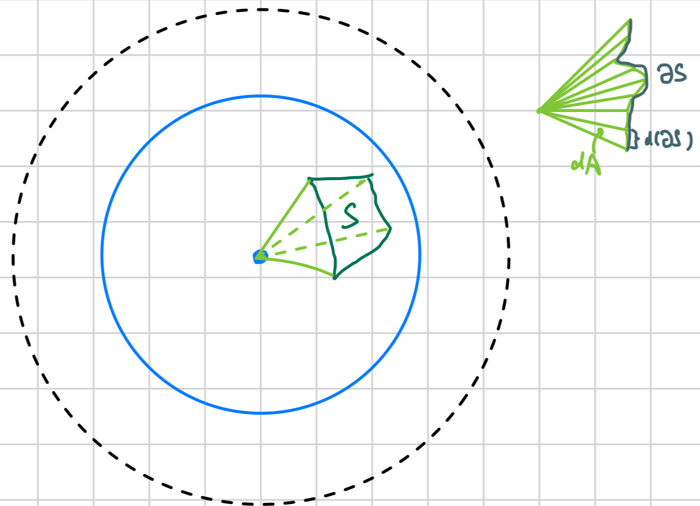

# Hyperbolic Surfaces 

The Poincaré ball model of $\mbb H^3\cong B_1(0)$ is equipped with 
the Riemmanian metric 
\[ 
    ds^2 = \df{4(dx^2 + dy^2 + dz^2)}{(1-r^2)^2}, \quad 
    g_{ab} = \df 4 {(1-r^2)^2} \begin{pmatrix} 
        1 & 0 & 0 \\ 
        0 & 1 & 0 \\ 
        0 & 0 & 1 
    \end{pmatrix}
\] 

:::{.proposition name="Poincaré's and hyperbolic radius"}
The length $\rho$ of a radial line which goes from $r=0$ to $r=R$ is 
$\rho = 2\, \mrm{arctanh}\, R$. 
::: 
_Proof:_ The radial scaling factor of length is $2/(1-r^2)$. 
Integrating this yields 
\[ 
    \rho =  \int_0^R dr\, \df{2}{1-r^2} 
    = \log \df{1+R}{1-R} = 2\, \mrm{arctanh}\, R
\] 

:::{.proposition #hSectorArea name="hyperbolic sector area"}
The area $A$ of the hyperbolic sector subtended by angle $\phi$ and 
Poincaré radius $R$ is 
\[ 
    A = \df{2\phi}{1/R^2 - 1}
\] 
:::
_Proof:_ 
The Jacobian of the inclusion map and the induced metric $g'$ in $(\theta, r)$ 
coordinates are, respectively, 
\begin{align}
    J &= T\, \iota = \begin{pmatrix} 
        \pd \theta (r\cos\theta) & \pd \theta (r\sin\theta) & 0 \\ 
        \pd r (r\cos\theta) & \pd r (r\sin\theta) & 0 
    \end{pmatrix} = \begin{pmatrix} 
        -r\sin\theta & r\cos\theta & 0 \\ 
        \cos\theta & \sin\theta & 0 
    \end{pmatrix} \\ 
    g' &= JgJ^T = \df 4 {(1-r^2)^2} \begin{pmatrix} 
        r^2 \\ & 1
    \end{pmatrix}, \quad \sqrt{\det g'} = \df{4r}{(1-r^2)^2}
\end{align}
Direct integration yields the desired area: 
\begin{align}
    A = \int_0^R \int_0^\phi \sqrt{\det g'} \, d\theta \, dr 
    &= \phi \int_0^R \df{4r}{(1-r^2)^2} \, dr
    = \phi \df{2R^2}{1-R^2} = \df{2\phi}{1/R^2 - 1}
\end{align}

:::{.proposition #hSectorLength name="hyperbolic sector length"}
The length $L$ of the arc subtended by angle $\phi$ and Poincaré radius $R$ is 
\[ 
    L = \df{2R\phi}{1-R^2}
\] 
:::
_Proof:_ 
The inclusion map $\iota'$ of the curve has Jacobian 
$J' = (-R\sin\theta, R\cos\theta, 0)$. 
The induced metric and length follows: 
\[ 
    g'' = J' g (J')^T = \df{4R^2}{(1-R^2)^2}, 
    \quad \sqrt{\det g''} = \df{2R}{1-R^2} \implies 
    L = \df{2R\phi}{1-R^2}
\] 

:::{.proposition #hAreaLaw name="area law? for hyperbolic spherical surfaces"}
Consider a surface $S$ on a hyperbolic sphere of radius $\rho\in (0, \infty)$. 
Let $A$ be the lateral area of the radial cone covering $S$. 
We have 
\[ 
    A = \tanh(\rho/2) |\partial S| \leq |\partial S|
\] 
```{r, echo=FALSE, fig.align='center', out.width='85%', fig.cap='Hypothetical (for contradiction) constructions are in green. Geodesics are in blue.'}

```
:::
_Proof:_ Comparing propositions \@ref(prp:hSectorArea) and \@ref(prp:hSectorLength), 
we obtain $A = RL$. Take the infinitesimal limit $(A, L)\mapsto (dA, d|\partial S|)$ 
and integrate to yield $A = R|\partial S| = \tanh(\rho/2) |\partial S| \leq |\partial S|$. 

:::{.hypothesis name="area law for hyperbolic MERAs"}
For MERAs representing the a Cayley graph such that 
the graph with the word metric is quasi-isometric to $\mbb H^3$, 
the area law is satisfied. 
:::
_Proof (???):_ We're making two assumptions (which I believe follow from 
the quasi-isometric condition): 

1. Given a subsystem $B$ of the lattice embedded on a hyperbolic sphere, 
    the area (size) of the subsystem is faithfully represented by the 
    hyperbolic area $S$ as in proposition \@ref(prp:hAreaLaw). 
2. The number of tensor legs crossing the lateral surface of the radial cone 
    covering $B$ is proportional to the lateral area $A$ of the surface. 

Given these assumptions, the area law follows from proposition \@ref(prp:hAreaLaw). 